<!---
h4rldev/h4rldev is a ✨ special ✨ repository because its `README.md` (this file) appears on your GitHub profile.
You can click the Preview link to take a look at your changes.
--->
<h4> Status and Last.FM </h4>
<a href="https://discord.com/users/275689969601871882">
    
</a>
    <br>
<a href="https://www.last.fm/user/h4rl3h">
    
</a>

<h4>Languages and Tools </h4>
<a href="https://www.rust-lang.org">
    
</a>
<a href="https://www.python.org">
    
</a>
<a href="https://en.wikipedia.org/wiki/Markdown">
    
</a>
<a href="https://developer.mozilla.org/en-US/docs/Web/HTML">
    
</a>
<a href="https://developer.mozilla.org/en-US/docs/Web/CSS">
    
</a>
<a href="https://developer.mozilla.org/en-US/docs/WebAssembly">
    
</a>
<a href="https://en.wikipedia.org/wiki/Bash_(Unix_shell)">
    
</a>
<a href="https://git-scm.com">
    
</a>
<a href="https://github.com/h4rldev">
    
</a>
<a href="https://github.com/microsoft/vscode">
    
</a>
<a href="https://neovim.io">
    
</a>
<a href="https://discord.com/users/275689969601871882">
    
</a>
<a href="https://www.linuxfoundation.org">
    
</a>
<a href="https://www.linkedin.com/in/oscar-sj%C3%B6din-jansson-528894295/">
    
</a>
    
<h4> Future Languages and Tools </h4>
<a href="https://www.typescriptlang.org">
    
</a>
<a href="https://java.com">
    
</a>
<a href="https://en.wikipedia.org/wiki/C_(programming_language)">
    
</a>
<a href="https://cplusplus.com">
    
</a>
<a href="https://go.dev/">
    
</a>
<a href="https://ziglang.org/">
    
</a>
<hr>
<h4>Data and misc.</h4>
<details>
    <summary>Discord Servers</summary>
    <a href="https://discord.gg/bMWgD85MJ6">
        ani / ani-gui
    </a>
    </br>
    <a href="https://discord.gg/aPdx2aFN5A">
        foobar
    </a>
</details>
<details>
    <summary>Wakatime</summary>

<!--START_SECTION:waka-->

```txt
From: 21 February 2023 - To: 24 November 2023

Total Time: 178 hrs 38 mins

Rust              108 hrs 34 mins >>>>>>>>>>>>>>>==========   58.87 %
Python            22 hrs 19 mins  >>>======================   12.10 %
HTML              11 hrs 2 mins   >========================   05.99 %
CSS               10 hrs 51 mins  >========================   05.89 %
TOML              7 hrs 47 mins   >========================   04.22 %
```

<!--END_SECTION:waka-->

</details>

<details>
    <summary>GitHub Metrics</summary>
    
</details>

<hr>

<h2 align="center">
    <a href=https://octo-ring.com/p/h4rldev/random>
           random
    </a>
    <br>
    <a href="https://octo-ring.com/p/h4rldev/prev">
        <
    </a>
    <a href="https://octo-ring.com/">
        
    </a>
    <a href="https://octo-ring.com/p/h4rldev/next">
        >
    </a>
    <br>
    <a href="https://octo-ring.com/register">
           register
    </a>
</h2>
<p align="center">
  <a href="https://github.com/h4rldev">
    
  </a>
</p>
